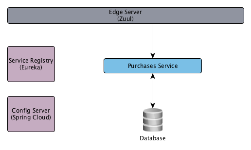

# Purchases Service

Modular DAO implementation of a service to manage a company purchases.

# Targeted Architecture

# DAO Implementation

In the purchases-service-api is defined the contract that the DAO must follow (PurchasesDao). Also, the Domain objects must follow the contract of each one of the entities in the domain package (Details and Purchase).
 

# Frameworks Used

## Spring Boot Overview

Spring Boot is the Spring's approach towards Convention over Configuration. Spring Boot comes with numerous Start Projects, each starter projects provides a set of conventions which ensures you have a opinionated production ready app.

You can read in detail about Spring Boot here - http://projects.spring.io/spring-boot/

## Spring Cloud Overview

Spring Cloud provides tools for developers to quickly build some of the common patterns in distributed systems (e.g. configuration management, service discovery, circuit breakers, intelligent routing, micro-proxy, control bus, one-time tokens, global locks, leadership election, distributed sessions, cluster state)

You can read in detail about Spring Cloud here - http://projects.spring.io/spring-cloud/

## Zuul

Zuul is built to enable dynamic routing, monitoring, resiliency and security.

## Eureka

Eureka is a REST based service that is primarily used in the AWS cloud for locating services for the purpose of load balancing and failover of middle-tier servers.

## Spring Cloud Config Overview

Spring Cloud Config provides support to externalize configuration in distributed systems. With the Config Server you have a central place to manage external properties for applications across all environments.

You can read in detail about Spring Cloud config here - http://cloud.spring.io/spring-cloud-config/

# Using the Application
##Dependencies

* Java 1.8
* Maven
* Docker: Install Docker by following the instructions for your platform on [Docker](https://docs.docker.com/engine/installation/) .

## Compilaton

On the root folder of this project run the following maven command to generate the Docker images:

    mvn clean install -Pdocker

# Test Reports

* mvn clean test (Creates code coverage report for unit tests)
* ~~mvn clean verify -P integration-test (Creates code coverage report for integration tests)~~
* mvn clean verify -P all-tests (Creates code coverage reports for unit and integration tests)

# TODO's

* Develop Integration Tests using Cucumber
* Develop Edge Server (zuul)
* Develop Config Server (Spring Cloud Config)
* Develop Service Registry (Eureka)